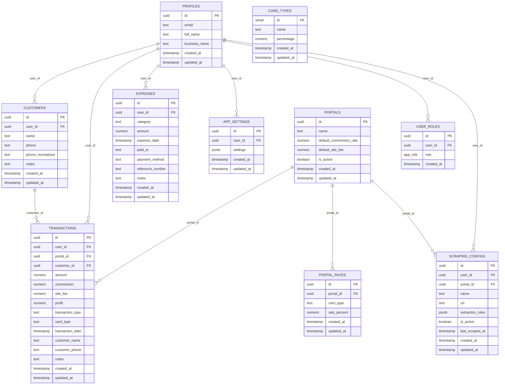

# 🗄️ Supabase PostgreSQL Database Schema

Complete database architecture, tables, columns, primary keys, foreign keys, and relationships for the **Payment-Track** platform.

---

## 📊 Entity Relationship Summary

---

## 📋 Table Definitions

### 1. `transactions`
Stores credit card withdrawals, repayments, customer charges, commissions, and portal fees.

| Column Name | Data Type | Nullable | Key / Ref | Description |
|-------------|-----------|----------|-----------|-------------|
| `id` | `uuid` | NO | **PK** (uuid_generate_v4()) | Unique transaction ID |
| `user_id` | `uuid` | NO | **FK** -> `auth.users.id` / `profiles.id` | User who created the transaction (Multi-tenant) |
| `portal_id` | `uuid` | NO | **FK** -> `portals.id` | Associated portal / gateway |
| `amount` | `numeric` | NO | - | Total transaction amount (₹) |
| `commission` | `numeric` | YES | - | Gross commission earned (₹) |
| `site_fee` | `numeric` | YES | - | Portal processing / site fee paid (₹) |
| `profit` | `numeric` | YES | - | Net profit = `commission - site_fee` (₹) |
| `transaction_type` | `text` | NO | - | Type (`withdrawal`, `repayment`, etc.) |
| `card_type` | `text` | YES | - | Card brand / category (`Visa`, `Mastercard`, `Amex`, etc.) |
| `transaction_date` | `timestamptz` | NO | - | Date/time transaction occurred |
| `customer_id` | `uuid` | YES | **FK** -> `customers.id` | Reference to canonical customer record |
| `customer_name` | `text` | YES | - | Legacy/fallback customer name (e.g. for Chummi portal) |
| `customer_phone` | `text` | YES | - | Legacy/fallback customer phone number |
| `notes` | `text` | YES | - | User-entered transaction notes and metadata |
| `created_at` | `timestamptz` | NO | - | Record creation timestamp |
| `updated_at` | `timestamptz` | NO | - | Record update timestamp |

---

### 2. `customers`
Dedicated canonical customer records for customer tracking, repeat customer auto-fill, and CRM analytics.

| Column Name | Data Type | Nullable | Key / Ref | Description |
|-------------|-----------|----------|-----------|-------------|
| `id` | `uuid` | NO | **PK** (gen_random_uuid()) | Unique customer ID |
| `user_id` | `uuid` | NO | **FK** -> `auth.users.id` | User/merchant who owns this customer record (Multi-tenant) |
| `name` | `text` | NO | - | Customer full name |
| `phone` | `text` | YES | - | Formatted customer phone number for display |
| `phone_normalized` | `text` | YES | - | Digits-only normalized phone number for search & deduplication |
| `notes` | `text` | YES | - | Notes, preferences, or customer history remarks |
| `created_at` | `timestamptz` | NO | - | Customer record creation timestamp |
| `updated_at` | `timestamptz` | NO | - | Customer record last update timestamp |

---

### 3. `expenses`
Stores business operating costs, worker salaries, rent, petrol, and overheads.

| Column Name | Data Type | Nullable | Key / Ref | Description |
|-------------|-----------|----------|-----------|-------------|
| `id` | `uuid` | NO | **PK** (uuid_generate_v4()) | Unique expense ID |
| `user_id` | `uuid` | NO | **FK** -> `auth.users.id` / `profiles.id` | Owner of the expense record |
| `category` | `text` | NO | - | Category (`Worker Salary`, `Petrol`, `Rent`, `Current Bills`, etc.) |
| `amount` | `numeric` | NO | - | Expense amount in ₹ |
| `expense_date` | `timestamptz` | NO | - | Date expense was incurred |
| `paid_to` | `text` | YES | - | Name of recipient / vendor / employee |
| `payment_method` | `text` | YES | - | Mode of payment (`Cash`, `UPI`, `Bank Transfer`) |
| `reference_number` | `text` | YES | - | Transaction / UPI reference ID |
| `notes` | `text` | YES | - | Additional remarks |
| `created_at` | `timestamptz` | NO | - | Timestamp created |
| `updated_at` | `timestamptz` | NO | - | Timestamp updated |

---

### 4. `portals`
Stores external gateways and portals through which transactions are processed.

| Column Name | Data Type | Nullable | Key / Ref | Description |
|-------------|-----------|----------|-----------|-------------|
| `id` | `uuid` | NO | **PK** (uuid_generate_v4()) | Portal unique identifier |
| `name` | `text` | NO | - | Portal name (`Upender`, `Chummi`, etc.) |
| `default_commission_rate`| `numeric` | YES | - | Standard commission percentage |
| `default_site_fee` | `numeric` | YES | - | Standard site fee percentage or fixed fee |
| `is_active` | `boolean` | YES | - | Active status (default: `true`) |
| `created_at` | `timestamptz` | NO | - | Timestamp created |
| `updated_at` | `timestamptz` | NO | - | Timestamp updated |

---

### 5. `portal_rates`
Card-specific commission rates configured per portal.

| Column Name | Data Type | Nullable | Key / Ref | Description |
|-------------|-----------|----------|-----------|-------------|
| `id` | `uuid` | NO | **PK** (uuid_generate_v4()) | Unique rate ID |
| `portal_id` | `uuid` | NO | **FK** -> `portals.id` | Associated portal |
| `card_type` | `text` | NO | - | Card type name |
| `rate_percent` | `numeric` | NO | - | Commission rate percentage |
| `created_at` | `timestamptz` | NO | - | Timestamp created |
| `updated_at` | `timestamptz` | NO | - | Timestamp updated |

---

### 6. `profiles`
User profiles synced with Supabase Auth (`auth.users`).

| Column Name | Data Type | Nullable | Key / Ref | Description |
|-------------|-----------|----------|-----------|-------------|
| `id` | `uuid` | NO | **PK** / **FK** -> `auth.users.id` | Supabase auth user UUID |
| `email` | `text` | YES | - | User login email address |
| `full_name` | `text` | YES | - | User display name |
| `business_name` | `text` | YES | - | Company or shop name |
| `created_at` | `timestamptz` | NO | - | Profile creation date |
| `updated_at` | `timestamptz` | NO | - | Profile last update date |

---

### 7. `user_roles`
Role-based access control (RBAC).

| Column Name | Data Type | Nullable | Key / Ref | Description |
|-------------|-----------|----------|-----------|-------------|
| `id` | `uuid` | NO | **PK** | Unique role assignment ID |
| `user_id` | `uuid` | NO | **FK** -> `auth.users.id` | User UUID |
| `role` | `app_role` (`admin` \| `user`)| NO | - | Assigned role |
| `created_at` | `timestamptz` | NO | - | Timestamp assigned |

---

### 8. `app_settings`
User custom settings, dropdown configurations, and UI preferences.

| Column Name | Data Type | Nullable | Key / Ref | Description |
|-------------|-----------|----------|-----------|-------------|
| `id` | `uuid` | NO | **PK** | Settings ID |
| `user_id` | `uuid` | NO | **FK** -> `auth.users.id` | User owner |
| `settings` | `jsonb` | NO | - | JSON object containing customized dropdown options |
| `created_at` | `timestamptz` | NO | - | Timestamp created |
| `updated_at` | `timestamptz` | NO | - | Timestamp updated |

---

### 9. `card_types`
Global card types registry.

| Column Name | Data Type | Nullable | Key / Ref | Description |
|-------------|-----------|----------|-----------|-------------|
| `id` | `serial` | NO | **PK** | Unique ID |
| `name` | `text` | NO | - | Card brand / name |
| `percentage` | `numeric` | NO | - | Default commission percentage |
| `created_at` | `timestamptz` | NO | - | Timestamp created |
| `updated_at` | `timestamptz` | NO | - | Timestamp updated |

---

### 10. `scraping_configs`
Automated portal scraping rules and credentials.

| Column Name | Data Type | Nullable | Key / Ref | Description |
|-------------|-----------|----------|-----------|-------------|
| `id` | `uuid` | NO | **PK** | Scraping config ID |
| `user_id` | `uuid` | NO | **FK** -> `auth.users.id` | Owner |
| `portal_id` | `uuid` | YES | **FK** -> `portals.id` | Associated portal |
| `name` | `text` | NO | - | Scraper name |
| `url` | `text` | NO | - | Target portal login URL |
| `extraction_rules` | `jsonb` | NO | - | Rules for parsing tables |
| `is_active` | `boolean` | YES | - | Is scraper enabled |
| `last_scraped_at` | `timestamptz` | YES | - | Last execution timestamp |
| `created_at` | `timestamptz` | NO | - | Timestamp created |
| `updated_at` | `timestamptz` | NO | - | Timestamp updated |

---

## 🔐 Custom Enums & Functions

### Enums
- **`app_role`**: `'admin'`, `'user'`

### Functions
- **`has_role(_user_id uuid, _role app_role) -> boolean`**: Checks if user has the specified security role.
