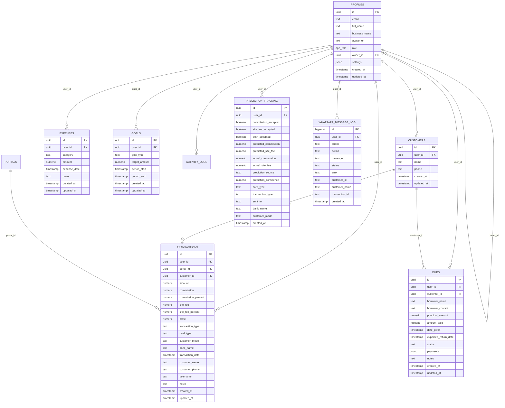

# 🗄️ Supabase PostgreSQL Database Schema

Complete database architecture, tables, columns, primary keys, foreign keys, indexes, RLS policies, and relationships for the **Payment-Track** platform.

---

## 📊 Entity Relationship Summary

---

## 📋 Table Definitions

### 1. `transactions`
Stores credit card withdrawals, repayments, customer charges, commissions, and portal fees.

| Column Name | Data Type | Nullable | Key / Ref | Description |
|-------------|-----------|----------|-----------|-------------|
| `id` | `uuid` | NO | **PK** (gen_random_uuid()) | Unique transaction ID |
| `user_id` | `uuid` | NO | **FK** -> `auth.users.id` | User who created the transaction (Multi-tenant) |
| `portal_id` | `uuid` | NO | **FK** -> `portals.id` | Associated portal / gateway |
| `amount` | `numeric` | NO | - | Total transaction amount (₹) (Check: `amount >= 0`) |
| `commission` | `numeric` | YES | - | Gross commission earned in ₹ |
| `commission_percent` | `numeric(5,2)` | YES | - | Commission rate percentage (%) |
| `site_fee` | `numeric` | YES | - | Portal processing / site fee paid in ₹ |
| `site_fee_percent` | `numeric(5,2)` | YES | - | Site fee rate percentage (%) |
| `profit` | `numeric` | YES | - | Net profit = `commission - site_fee` (₹) |
| `transaction_type` | `text` | NO | - | Type (`withdrawal`, `repayment`, `cash`, etc.) |
| `card_type` | `text` | YES | - | Card brand / category (`Visa`, `Mastercard`, `Amex`, `RuPay`) |
| `customer_mode` | `text` | YES | - | Customer transaction mode (`Offline`, `Online`) |
| `bank_name` | `text` | YES | - | Bank institution name |
| `transaction_date` | `timestamptz` | NO | - | Date/time transaction occurred |
| `customer_id` | `uuid` | YES | **FK** -> `customers.id` | Reference to canonical customer record |
| `customer_name` | `text` | YES | - | Customer name snapshot / fallback |
| `customer_phone` | `text` | YES | - | Customer phone snapshot / fallback |
| `username` | `text` | YES | - | Profile username snapshot |
| `notes` | `text` | YES | - | User-entered transaction notes |
| `created_at` | `timestamptz` | NO | - | Record creation timestamp |
| `updated_at` | `timestamptz` | NO | - | Record update timestamp |

---

### 2. `customers`
Dedicated canonical customer records for customer tracking, repeat customer auto-fill, and CRM analytics.

| Column Name | Data Type | Nullable | Key / Ref | Description |
|-------------|-----------|----------|-----------|-------------|
| `id` | `uuid` | NO | **PK** (gen_random_uuid()) | Unique customer ID |
| `user_id` | `uuid` | NO | **FK** -> `auth.users.id` | User/merchant who owns this customer record (Multi-tenant) |
| `name` | `text` | NO | - | Customer full name |
| `phone` | `text` | YES | - | Normalized 10-digit customer phone number (Unique per user) |
| `created_at` | `timestamptz` | NO | - | Customer record creation timestamp |
| `updated_at` | `timestamptz` | NO | - | Customer record last update timestamp (Trigger-managed) |

---

### 3. `expenses`
Stores business operating costs, worker salaries, rent, petrol, and overheads.

| Column Name | Data Type | Nullable | Key / Ref | Description |
|-------------|-----------|----------|-----------|-------------|
| `id` | `uuid` | NO | **PK** (gen_random_uuid()) | Unique expense ID |
| `user_id` | `uuid` | NO | **FK** -> `auth.users.id` | Owner of the expense record |
| `category` | `text` | NO | - | Category (`Worker Salary`, `Petrol`, `Rent`, `Current Bills`, etc.) |
| `amount` | `numeric` | NO | - | Expense amount in ₹ |
| `expense_date` | `timestamptz` | NO | - | Date expense was incurred |
| `notes` | `text` | YES | - | Additional remarks |
| `created_at` | `timestamptz` | NO | - | Timestamp created |
| `updated_at` | `timestamptz` | NO | - | Timestamp updated |

---

### 4. `dues`
Money lent / borrower dues tracking with repayment ledger and status calculation.

| Column Name | Data Type | Nullable | Key / Ref | Description |
|-------------|-----------|----------|-----------|-------------|
| `id` | `uuid` | NO | **PK** (gen_random_uuid()) | Unique dues ID |
| `user_id` | `uuid` | NO | **FK** -> `auth.users.id` | Record owner |
| `customer_id` | `uuid` | YES | **FK** -> `customers.id` | Associated customer |
| `borrower_name` | `text` | NO | - | Borrower full name |
| `borrower_contact` | `text` | YES | - | Borrower phone or contact info |
| `principal_amount` | `numeric` | NO | - | Total amount lent (₹) (Check: `>= 0`) |
| `amount_paid` | `numeric` | NO | - | Total amount recovered (₹) (Check: `>= 0`) |
| `date_given` | `timestamptz` | NO | - | Date loan / credit was given |
| `expected_return_date` | `timestamptz` | YES | - | Target date for full repayment |
| `status` | `text` | NO | - | Status (`outstanding`, `partially_paid`, `paid`, `overdue`) |
| `payments` | `jsonb` | NO | - | Array of partial payment logs |
| `notes` | `text` | YES | - | Notes / remarks |
| `created_at` | `timestamptz` | NO | - | Timestamp created |
| `updated_at` | `timestamptz` | NO | - | Timestamp updated |

---

### 5. `goals`
Financial performance targets (monthly, quarterly, yearly).

| Column Name | Data Type | Nullable | Key / Ref | Description |
|-------------|-----------|----------|-----------|-------------|
| `id` | `uuid` | NO | **PK** (gen_random_uuid()) | Goal ID |
| `user_id` | `uuid` | NO | **FK** -> `auth.users.id` | User owner |
| `goal_type` | `text` | NO | - | Goal scope (`monthly`, `quarterly`, `yearly`) |
| `target_amount` | `numeric` | NO | - | Target amount in ₹ (Check: `> 0`) |
| `period_start` | `timestamptz` | NO | - | Goal period start date |
| `period_end` | `timestamptz` | NO | - | Goal period end date (Check: `>= period_start`) |
| `created_at` | `timestamptz` | NO | - | Timestamp created |
| `updated_at` | `timestamptz` | NO | - | Timestamp updated (Trigger-managed) |

---

### 6. `prediction_tracking`
AI commission and site fee prediction accuracy tracking.

| Column Name | Data Type | Nullable | Key / Ref | Description |
|-------------|-----------|----------|-----------|-------------|
| `id` | `uuid` | NO | **PK** (gen_random_uuid()) | Event ID |
| `user_id` | `uuid` | NO | **FK** -> `auth.users.id` | User owner |
| `commission_accepted` | `boolean` | NO | - | Was AI commission accepted as-is? |
| `site_fee_accepted` | `boolean` | NO | - | Was AI site fee accepted as-is? |
| `both_accepted` | `boolean` | NO | - | Were both values accepted? |
| `predicted_commission`| `numeric(6,2)`| NO | - | AI predicted commission % |
| `predicted_site_fee` | `numeric(6,2)`| NO | - | AI predicted site fee % |
| `actual_commission` | `numeric(6,2)`| NO | - | User submitted commission % |
| `actual_site_fee` | `numeric(6,2)`| NO | - | User submitted site fee % |
| `prediction_source` | `text` | NO | - | Cascade tier name |
| `prediction_confidence`| `numeric(4,3)`| NO | - | Confidence score (0.0 to 1.0) |
| `card_type` | `text` | NO | - | Card brand |
| `transaction_type` | `text` | NO | - | Transaction type |
| `sent_to` | `text` | NO | - | Portal / recipient |
| `bank_name` | `text` | YES | - | Bank name |
| `customer_mode` | `text` | YES | - | Customer mode |
| `created_at` | `timestamptz` | NO | - | Event timestamp |

---

### 7. `whatsapp_message_log`
Audit trail recording all outbound WhatsApp customer receipts and welcome notifications.

| Column Name | Data Type | Nullable | Key / Ref | Description |
|-------------|-----------|----------|-----------|-------------|
| `id` | `bigint` | NO | **PK** (BIGSERIAL) | Primary Key ID |
| `user_id` | `uuid` | YES | **FK** -> `auth.users.id` | Sender user ID |
| `phone` | `text` | NO | - | Recipient phone number |
| `action` | `text` | NO | - | Action type (`welcome`, `receipt`, `reminder`) |
| `message` | `text` | YES | - | Outbound message body |
| `status` | `text` | NO | - | Status (`sent`, `failed`) |
| `error` | `text` | YES | - | Failure explanation if error occurred |
| `customer_id` | `text` | YES | - | Related customer identifier |
| `customer_name` | `text` | YES | - | Related customer name |
| `transaction_id` | `text` | YES | - | Related transaction identifier |
| `created_at` | `timestamptz` | NO | - | Log creation timestamp |

---

### 8. `activity_logs`
Audit log recording user actions, mutations, and system events.

| Column Name | Data Type | Nullable | Key / Ref | Description |
|-------------|-----------|----------|-----------|-------------|
| `id` | `uuid` | NO | **PK** (gen_random_uuid()) | Log entry ID |
| `user_id` | `uuid` | NO | **FK** -> `auth.users.id` | Acting user |
| `action` | `text` | NO | - | Action identifier (e.g. `transaction.created`) |
| `category` | `text` | NO | - | Category (e.g. `transaction`, `expense`, `customer`) |
| `description` | `text` | NO | - | Human-readable action description |
| `metadata` | `jsonb` | YES | - | Structured details (record IDs, changed fields) |
| `created_at` | `timestamptz` | NO | - | Timestamp created |

---

### 9. `portals`
Stores external gateways and portals through which transactions are processed.

| Column Name | Data Type | Nullable | Key / Ref | Description |
|-------------|-----------|----------|-----------|-------------|
| `id` | `uuid` | NO | **PK** (gen_random_uuid()) | Portal unique identifier |
| `name` | `text` | NO | - | Portal name (`Upender`, `Chummi`, etc.) |
| `default_commission_rate`| `numeric` | YES | - | Standard commission percentage |
| `default_site_fee` | `numeric` | YES | - | Standard site fee percentage or fixed fee |
| `is_active` | `boolean` | YES | - | Active status (default: `true`) |
| `created_at` | `timestamptz` | NO | - | Timestamp created |
| `updated_at` | `timestamptz` | NO | - | Timestamp updated |

---

### 10. `profiles`
User profiles synced with Supabase Auth (`auth.users`), supporting multi-tenant staff management.

| Column Name | Data Type | Nullable | Key / Ref | Description |
|-------------|-----------|----------|-----------|-------------|
| `id` | `uuid` | NO | **PK** / **FK** -> `auth.users.id` | Supabase auth user UUID |
| `email` | `text` | YES | - | User login email address |
| `full_name` | `text` | YES | - | User display name |
| `business_name` | `text` | YES | - | Company or shop name |
| `avatar_url` | `text` | YES | - | Public URL of user avatar image |
| `role` | `app_role` (`admin` \| `user` \| `staff`)| NO | - | User role (default: `'user'`) |
| `owner_id` | `uuid` | YES | **FK** -> `profiles.id` | Business owner UUID for staff accounts |
| `settings` | `jsonb` | NO | - | User customized dropdown options & preferences (default: `{}`) |
| `created_at` | `timestamptz` | NO | - | Profile creation date |
| `updated_at` | `timestamptz` | NO | - | Profile last update date |

---

## 🔐 Custom Enums & Security Functions

### Enums
- **`app_role`**: `'admin'`, `'user'`, `'staff'`

### Security Functions
- **`private.is_admin(user_uuid uuid) -> boolean`**: Checks if user is an administrator via `profiles`.
- **`private.get_business_id(user_uuid uuid) -> uuid`**: Resolves owner user UUID for staff accounts to enforce multi-tenant isolation.
